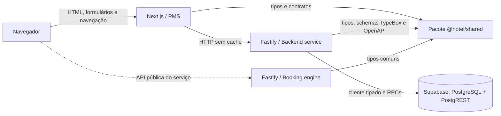
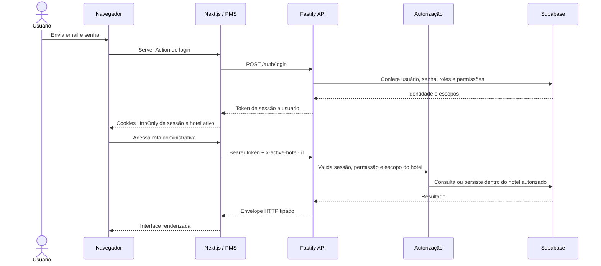
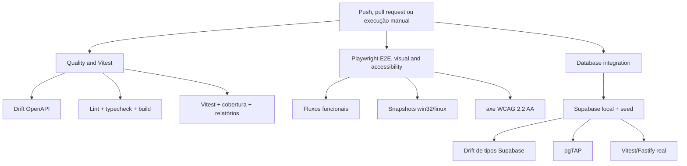

# Arquitetura e fluxos do sistema

Os diagramas abaixo são texto Mermaid versionado. Eles descrevem os limites atuais do sistema e devem mudar no mesmo pull request que alterar uma relação representada.

## Contexto e componentes

Fontes de verdade: `apps/pms/src`, `apps/backend-service/src`, `apps/booking-engine-service/src`, `packages/shared/src` e `supabase/migrations`. Atualize este diagrama ao adicionar um serviço, uma integração entre componentes ou um novo armazenamento.

## Requisição autenticada e hotel ativo

Fontes de verdade: `apps/pms/src/lib/auth.ts`, `apps/pms/src/lib/activeHotel.ts`, `apps/pms/src/lib/adminApi.ts`, middlewares e rotas em `apps/backend-service/src`. Atualize este diagrama quando cookies, headers, autenticação, autorização ou isolamento por hotel mudarem.

## Pipeline de qualidade

Fontes de verdade: `.github/workflows/ci.yml`, `package.json`, `turbo.json`, as configurações Vitest/Playwright e os orquestradores em `scripts`. Atualize este diagrama quando jobs, comandos bloqueantes, relatórios ou artefatos do CI mudarem.
