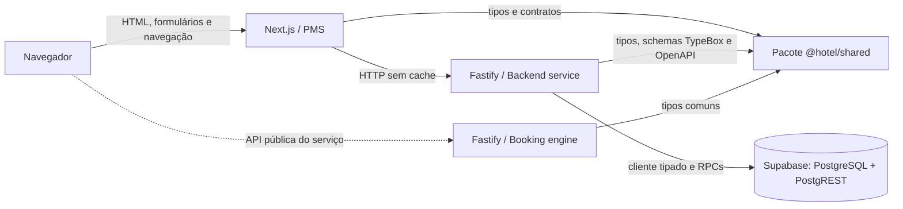
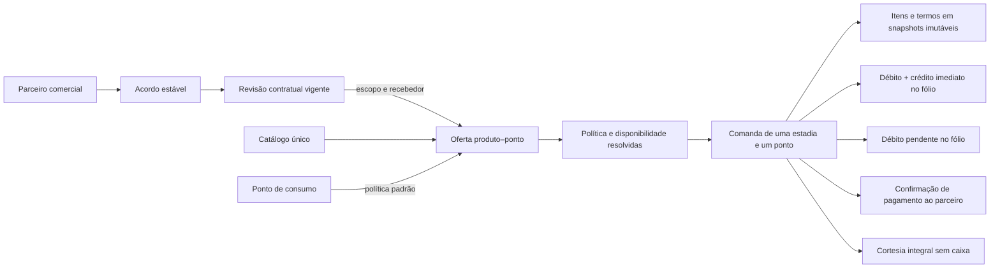
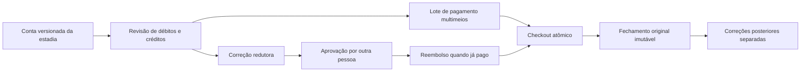
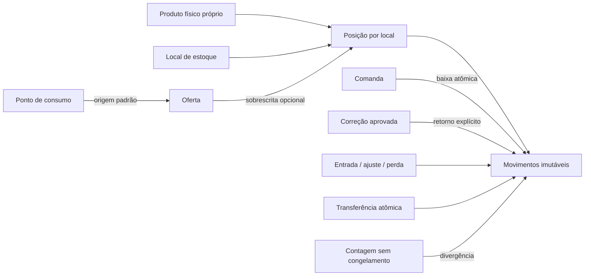
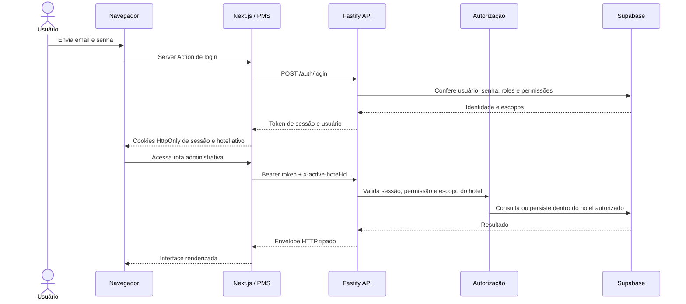
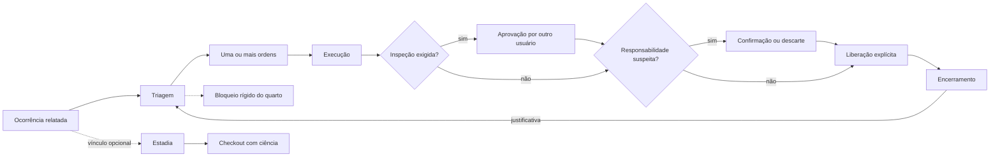
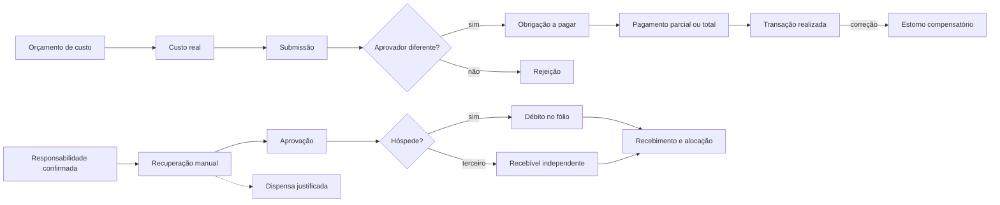
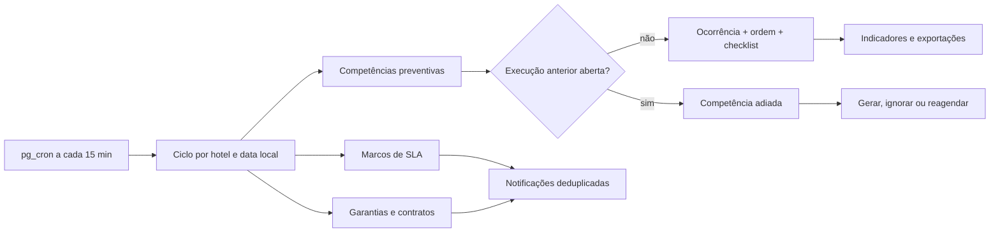
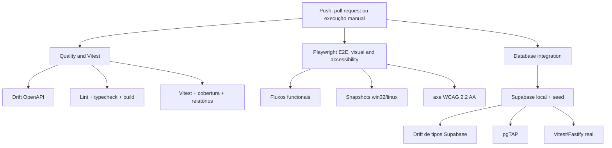

# Arquitetura e fluxos do sistema

Os diagramas abaixo são texto Mermaid versionado. Eles descrevem os limites atuais do sistema e devem mudar no mesmo pull request que alterar uma relação representada.

Volte ao [índice técnico](README.md) ou consulte o
[guia de desenvolvimento](development-guide.md) para executar os componentes.

## Contexto e componentes

Fontes de verdade: `apps/pms/src`, `apps/backend-service/src`, `apps/booking-engine-service/src`, `packages/shared/src` e `supabase/migrations`. Atualize este diagrama ao adicionar um serviço, uma integração entre componentes ou um novo armazenamento.

## Catálogo comercial

Produtos e serviços pertencem ao hotel ativo e identificam um fornecedor
imutável: o próprio hotel ou um parceiro comercial do mesmo hotel. O catálogo
usa categorias controladas, arquivamento lógico e trilha imutável de criação,
edição, ativação e arquivamento. Trocar o fornecedor exige arquivar o item e
criar outro, preservando a identidade histórica.

## Configurações de vendas e consumo

Pontos de consumo representam canais operacionais do hotel, como Recepção,
Frigobar, Restaurante e Piscina. Um produto pode ser ofertado em vários pontos,
sempre com o preço atual do catálogo. Cada ponto define uma política padrão de
cobrança e cada oferta pode herdá-la ou sobrescrevê-la.

Ponto, oferta, produto e categoria precisam estar ativos e não arquivados para
que uma oferta esteja operacionalmente disponível. Produtos terceirizados
também exigem parceiro ativo e um acordo cuja revisão vigente abranja o ponto.
O recebedor da revisão limita os modos permitidos: cobrança do hotel exige
recebedor `hotel` ou `both`, enquanto `partner_direct` só aparece em
sobrescritas de oferta e exige `partner` ou `both`. Alterações são auditadas e
não existe exclusão física.

O acordo possui identidade estável e revisões numeradas. Revisões ativadas são
imutáveis; uma nova revisão encerra atomicamente a anterior e não pode se
sobrepor a outro acordo do mesmo parceiro no mesmo ponto. Os modelos são
aluguel fixo, comissão sobre venda líquida operacional e híbrido com mínimo
garantido opcional. Os termos são preservados nos itens para a apuração futura,
mas esta camada ainda não calcula aluguel/comissão, faz split, repasse ou
liquidação.

Somente uma estadia em `checked_in` recebe novas comandas. O servidor resolve
preço, oferta, política e revisão contratual para o horário informado, compara
tokens de versão e grava cabeçalho, itens, auditoria e efeitos financeiros em
uma única transação PostgreSQL. A chave idempotente devolve a mesma comanda
para repetições idênticas e rejeita payload divergente.

`stay_folio` cria um débito agregado; `hotel_immediate` cria débito, transação,
crédito e alocação integral; `partner_direct` registra somente o recebimento
externo confirmado; cortesia registra desconto integral. O antigo
`stay_consumption` é migrado para comandas `legacy_unclassified`, sem gerar
dívida ou pagamento retroativo. Comandas, itens, eventos e vínculos financeiros
são imutáveis; correções redutoras usam lançamentos compensatórios.

## Conta da estadia e fechamento

Cada estadia mantém uma conta própria, versionada a cada mutação financeira. A
visão consolidada agrupa hospedagem, consumos, danos, pagamentos, ajustes e
reembolsos, mas preserva cada lançamento original. Pagamentos parciais ou
multimeios formam um lote atômico e são alocados no servidor; nunca podem
exceder o saldo.

Ajustes parciais e anulações nunca alteram comandas. Correções pagas somente
terminam depois do reembolso do hotel ou da confirmação externa do parceiro.
Após checkout, apenas correções redutoras podem criar crédito, sem reabrir a
estadia. O fechamento exige hospedagem e consumo quitados, nenhum crédito ou
correção pendente e ciência explícita das cobranças de dano aceitas como
exceção. O snapshot original alimenta o extrato HTML não fiscal e não muda com
correções posteriores.

Fontes de verdade: migration `20260906010000_finalize_stay_accounts.sql`,
`stayAccountsRepository.ts`, `stayAccountRoutes.ts`, contratos em
`packages/shared/src/api-contract.ts` e a jornada em
`apps/pms/src/app/dashboard/reservations/checkout`.

## Estoque básico do hotel

O estoque é isolado por hotel e por local. A migration cria apenas o local
“Estoque central”; cada produto precisa ser ativado explicitamente em uma
posição produto–local. São elegíveis somente produtos físicos fornecidos pelo
hotel e vendidos por unidade ou porção. Serviços e itens de parceiros não
entram no estoque.

O saldo é materializado na posição e protegido por uma versão monotônica; o
razão registra saldo anterior e resultante. Entradas com custo recalculam o
custo médio ponderado, enquanto saídas preservam o custo. A valoração ignora a
parcela negativa e só é exibida com `read_inventory_costs`.

A origem é resolvida pela oferta e, quando ausente, pelo ponto. Produto
controlado sem posição válida torna a oferta indisponível. A postagem da
comanda bloqueia as posições e baixa estoque dentro da mesma transação; a
política do hotel bloqueia saldo insuficiente ou permite saldo negativo com
alerta auditável. Correções só retornam a quantidade física explicitamente
informada e nunca inferem devolução de um desconto ou reembolso financeiro.

Fontes de verdade: migration `20260907010000_create_hotel_inventory.sql`,
`inventoryRepository.ts`, `inventoryRoutes.ts`, contratos em
`packages/shared/src/api-contract.ts` e o módulo
`apps/pms/src/app/dashboard/inventory`.

## Requisição autenticada e hotel ativo

Fontes de verdade: `apps/pms/src/lib/auth.ts`, `apps/pms/src/lib/activeHotel.ts`, `apps/pms/src/lib/adminApi.ts`, middlewares e rotas em `apps/backend-service/src`. Atualize este diagrama quando cookies, headers, autenticação, autorização ou isolamento por hotel mudarem.

## Danos, manutenção e bloqueio operacional

Uma ocorrência descreve o problema e mantém o contexto do quarto, área,
equipamento e, quando aplicável, da estadia. O trabalho executável fica em uma
ou mais ordens. Alterações de estado, inspeções, liberações e a ciência no
checkout usam funções transacionais do PostgreSQL para que estado e auditoria
sejam persistidos juntos.

O calendário deriva a disponibilidade dos bloqueios ativos: um bloqueio não
liberado continua rígido depois da previsão e passa a ser mostrado como
atrasado. `rooms.status` permanece compatível para estados legados, enquanto
novas interdições de manutenção são criadas somente em `room_blocks`.

Evidências ficam no bucket privado `maintenance-evidence`; o navegador recebe
apenas URLs assinadas temporárias e nunca credenciais administrativas. O módulo
operacional não realoca hóspedes nem cria cobranças automaticamente.

Fontes de verdade: migration `20260831010000_create_maintenance_core.sql`,
`maintenanceRepository.ts`, `maintenanceRoutes.ts`, os contratos em
`packages/shared/src/api-contract.ts` e as páginas em
`apps/pms/src/app/dashboard/maintenance`.

## Execução financeira de danos e manutenção

O fólio é o razão operacional da estadia. Débitos e créditos postados são
imutáveis, pagamentos podem ser alocados entre vários débitos e correções são
novos lançamentos compensatórios. Os campos legados de total da estadia são
mantidos como projeções de compatibilidade; saldo e situação de pagamento são
derivados de `stay_folio_entries` e `stay_folio_allocations`.

Proposta, aprovação e liquidação possuem permissões independentes, e o autor
não aprova o próprio item. A conclusão operacional da ocorrência não depende da
quitação financeira. Documentos ficam no bucket privado
`maintenance-financial-documents`; valores e arquivos são expostos somente a
usuários com permissão financeira. O checkout exige ciência dos débitos de dano
em aberto, mas continua permitido.

Fontes de verdade: migration `20260831020000_create_maintenance_finance.sql`,
`maintenanceFinanceRepository.ts`, `maintenanceFinanceRoutes.ts`, contratos em
`packages/shared/src/api-contract.ts` e a central
`apps/pms/src/app/dashboard/maintenance/finance`.

## Gestão avançada de manutenção

Planos preventivos geram ocorrências e ordens comuns, preservando o mesmo fluxo
operacional e financeiro. Cada competência possui chave única por plano e data
local; quando há uma execução anterior aberta, ela permanece adiada até uma
decisão gerencial justificada. O checklist da ordem é um snapshot independente
do template, de modo que edições posteriores no plano não alteram trabalho já
emitido.

O SLA usa horas corridas e é copiado para a ocorrência no momento do registro.
Pausas e esperas não suspendem o relógio, reaberturas mantêm os prazos originais
e ocorrências anteriores à migration não recebem violações retroativas. O ciclo
automático registra chave, duração, contadores e erro, permitindo reprocessamento
idempotente pela interface administrativa.

Fornecedores não substituem o responsável interno. Contratos e ativos podem
especializar o contexto da ordem, mas não concluem trabalho nem geram obrigação
financeira automaticamente. Termos comerciais, custos e métricas financeiras
continuam protegidos pela permissão financeira. Documentos gerenciais ficam no
bucket privado `maintenance-management-documents` e são acessados por URLs
assinadas de curta duração.

Fontes de verdade: migration
`20260902010000_create_maintenance_management.sql`,
`maintenanceManagementRepository.ts`, `maintenanceManagementRoutes.ts`, os
contratos em `packages/shared/src/api-contract.ts`, o guia
`docs/maintenance-management.md` e as páginas de gestão em
`apps/pms/src/app/dashboard/maintenance`.

## Pipeline de qualidade

Fontes de verdade: `.github/workflows/ci.yml`, `package.json`, `turbo.json`, as configurações Vitest/Playwright e os orquestradores em `scripts`. Atualize este diagrama quando jobs, comandos bloqueantes, relatórios ou artefatos do CI mudarem.
