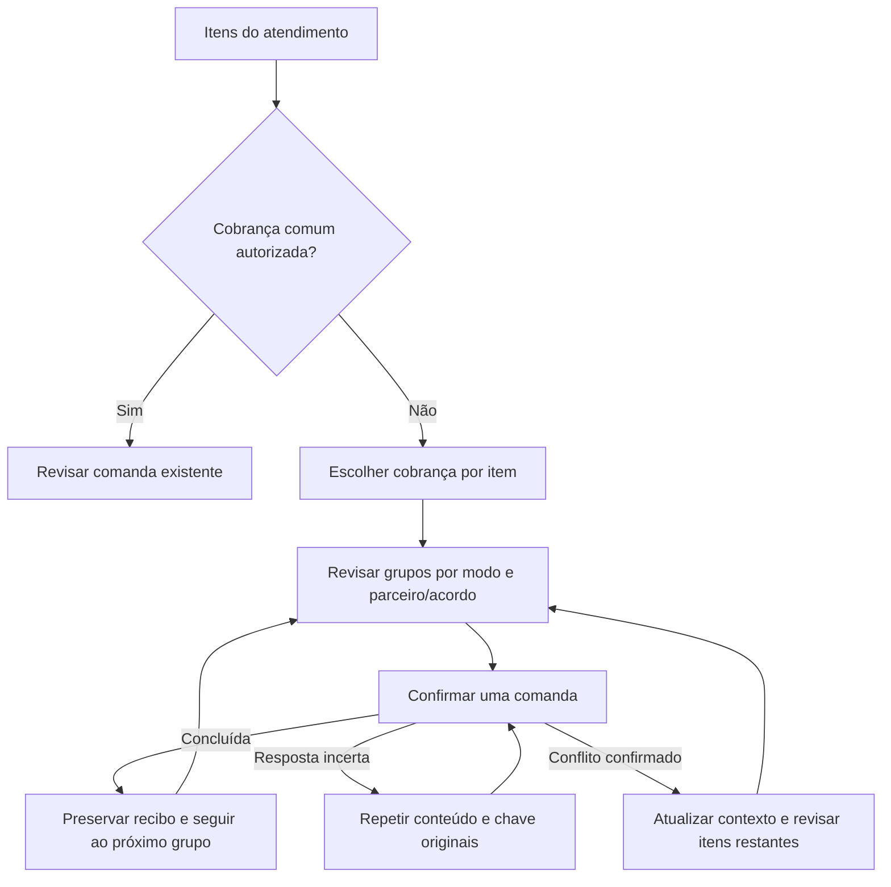
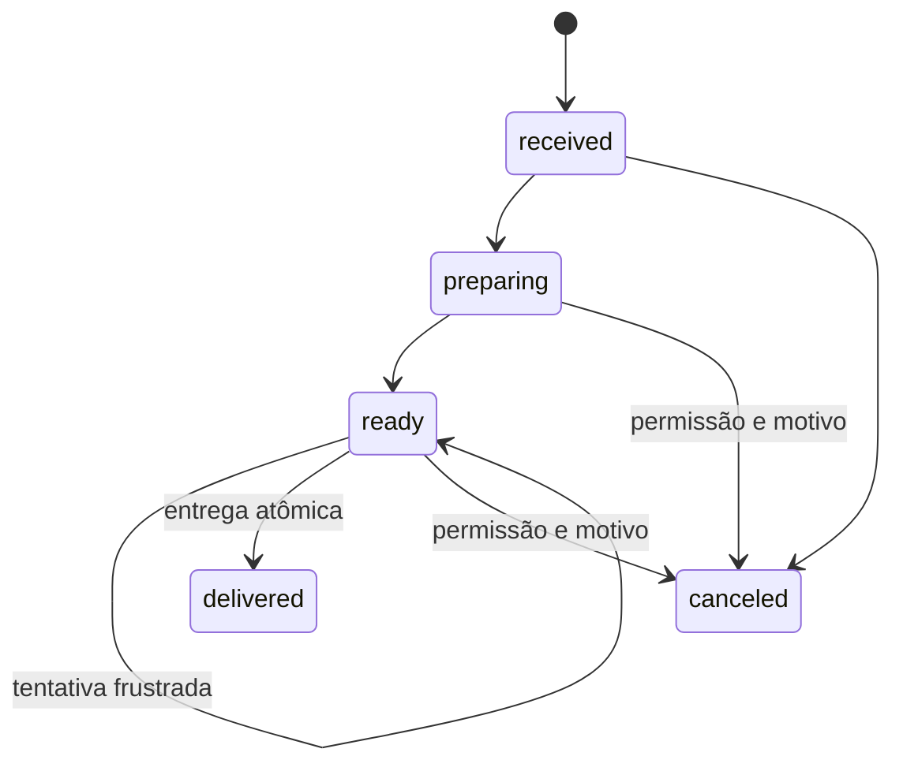
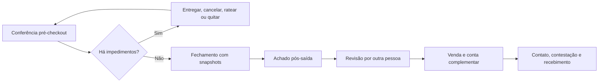

# Fechamento gerencial de consumo

Este guia descreve a operação do painel gerencial e das apurações comerciais.
As telas e ações aparecem conforme as permissões do usuário e sempre usam o
hotel ativo.

## Interpretar o painel

Em **Vendas e consumo > Painel gerencial**, escolha período e dimensão. Venda
bruta representa o valor original dos itens; descontos incluem reduções
concluídas; cortesias preservam o bruto para análise, mas têm líquido zero;
estornos evidenciam valores revertidos. “Recebido pelo hotel” reúne fólio e
pagamento imediato. “Recebido por parceiros” reúne somente `partner_direct`.

Os cartões usam todo o recorte. A tabela pode ter paginação sem alterar esses
totais. Use o histórico para conferir comandas e o CSV para trabalhar o recorte
em outra ferramenta. O relatório é gerencial e não fiscal.

## Preparar e revisar uma apuração

1. Em **Apurações**, selecione um mês já encerrado.
2. Gere o demonstrativo do candidato. Meses sem venda ainda aparecem quando há
   aluguel ou mínimo garantido vigente.
3. Confira fontes, revisões e memória de cálculo. Recalcular substitui apenas um
   rascunho ou item em revisão e incrementa sua versão.
4. Envie para revisão. Uma pessoa diferente do preparador deve aprovar.
5. Se fontes, acordos ou correções mudarem, atualize e confirme novamente. Uma
   correção ou reembolso pendente impede a aprovação.

Aluguel trimestral é dividido por três e anual por doze. Vigências parciais são
apropriadas pelos dias civis do mês. Comissão incide na venda líquida. No
híbrido, prevalece o maior valor entre aluguel mais comissão e mínimo garantido.

## Registrar a quitação

Valor líquido positivo indica repasse do hotel ao parceiro; negativo indica
cobrança do parceiro pelo hotel. Informe exatamente o saldo, um meio, data e,
quando existir, a referência operacional. A baixa registra uma transação no PMS,
mas não movimenta conta bancária. Para corrigir uma baixa, use a reversão com
justificativa; o sistema mantém a transação original e cria outra compensatória.

Correções concluídas após a aprovação não reabrem o demonstrativo. A diferença
é reconhecida uma única vez no primeiro período posterior ainda aberto e aponta
para a correção e o fechamento original.

## Alertas

O painel e a página inicial dão acesso à central **Pendências**, que reúne saldos
próximos do checkout, estoque abaixo do mínimo, acordos vencendo e apurações
pendentes, junto às condições autorizadas de manutenção. A central sincroniza as
origens a cada 15 minutos ou pelo botão **Atualizar pendências**. O horário da
última atualização e eventuais falhas são visíveis. Consultar a lista não executa
a sincronização e não são enviadas notificações externas.

Leitura é pessoal; **Assumir** indica quem está tratando o problema. Somente quem
assumiu pode devolver à fila. Ler ou dispensar uma notificação histórica não
resolve uma condição. A resolução aparece após a origem deixar de exigir
atenção; fim de vigência é indicado sem presumir renovação. Uma condição que
reaparece inicia outro episódio, sem herdar responsável nem leitura.

## Cobranças incompatíveis no lançamento

Use **Organizar cobranças** quando os itens não aceitarem uma cobrança comum.
Escolha um modo autorizado para cada item e confira os grupos sugeridos. Pagamento
direto é separado por parceiro e acordo; cortesia não é uma solução automática.
Confirme cada grupo individualmente, incluindo o recebimento quando aplicável.

Os recibos concluídos permanecem no histórico mesmo se outro grupo falhar.
Se a resposta for incerta, **Repetir a mesma solicitação** consulta/conclui a mesma
operação, sem criar outra cobrança. Se houver conflito confirmado, atualize preços
e políticas e revise os grupos restantes. A fila existe somente na página: após
sair ou recarregar, confira o histórico antes de reconstruir itens pendentes.

## Pedidos com preparo e entrega

**Vendas e consumo > Pedidos** separa a operação do restaurante e do serviço de
quarto da comanda financeira. O recebimento congela oferta, preço, regra
comercial e reserva estoque, benefício e limite empresarial. A fila acompanha
preparo, prontidão e tentativas de entrega. Somente a entrega cria as comandas,
baixa o estoque e materializa todos os grupos de cobrança em uma transação. Um
cancelamento libera as reservas; após o preparo, exige permissão e motivo.

O lançamento rápido continua disponível para recepção e frigobar. Ele cria a
comanda imediatamente e aplica o hóspede principal e os benefícios elegíveis
como padrão.

## Pagadores, empresas e benefícios

A conta da estadia mostra uma subconta para o hóspede principal, cada
acompanhante cadastrado e a empresa autorizada. Distribua integralmente cada
lançamento; consumos exigem também a quantidade atribuída a cada pagador.
Pagamentos reduzem apenas a subconta escolhida e podem usar vários meios.

Empresas pagadoras têm cadastro e política próprios. A autorização de crédito
passa por solicitação e decisão de outra pessoa, com limite, validade e
categorias cobertas. No checkout, o saldo empresarial válido vira um recebível
separado; recebimentos posteriores podem ser parciais e multimeios.

Planos de benefício são versionados. A estadia recebe uma concessão congelada e
o sistema escolhe deterministicamente a maior vantagem, priorizando expiração e
antiguidade no empate. O valor bruto e os efeitos comerciais do produto são
preservados; créditos não usados expiram no checkout.

## Conferência de saída e conta complementar

Antes do checkout, confira pedidos abertos, rateios, saldos pessoais, crédito
empresarial, reservas e divergências. Pedido aberto é impedimento absoluto.
Hóspedes e acompanhantes precisam estar quitados; somente saldo empresarial
coberto pode virar recebível. O fechamento guarda snapshots e não é alterado
depois da saída.

Em **Vendas e consumo > Pós-saída**, registre um achado ocorrido durante a
hospedagem com relato e evidência privada. Outra pessoa aprova ou rejeita. A
aprovação cria venda, estoque e conta complementar vinculada ao fechamento. A
equipe registra contatos, promessas e contestações; recebimentos parciais usam
idempotência. Uma dispensa exige autorização e cria o desfecho compensatório,
sem devolver estoque consumido.

## Frigobar físico e liquidação de parceiros

Quando o quarto possui composição ativa, o frigobar usa uma localização interna
e uma contagem física própria. A reposição transfere lotes por FEFO a partir do
abastecedor e conclui a tarefa correspondente da governança. O lançamento de
consumo baixa o estoque do quarto uma única vez e mantém preço, benefício,
parceiro e apuração comercial.

Na apuração mensal, aprovação, liquidação e contestação são estados separados.
Uma divergência pode atingir somente venda, recebimento direto, aluguel,
comissão, garantia mínima ou ajuste. O saldo não contestado continua disponível
para liquidação parcial. Pagamentos em dinheiro exigem sessão de caixa aberta;
estornos permanecem compensatórios.
