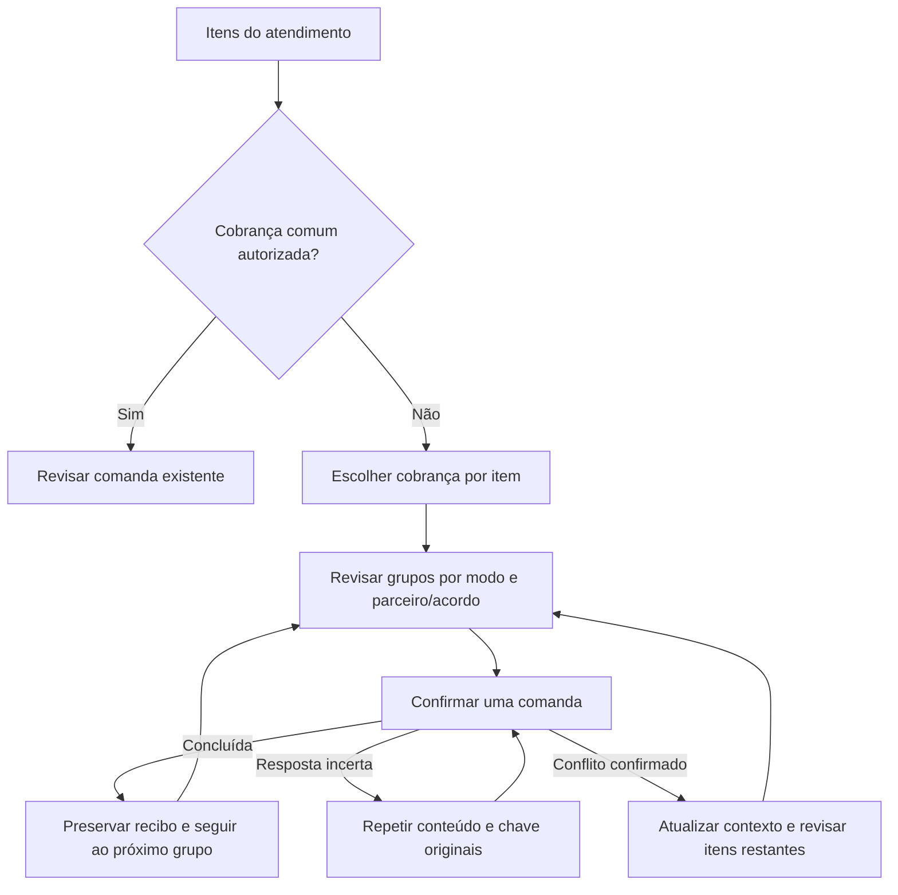

# Fechamento gerencial de consumo

Este guia descreve a operação do painel gerencial e das apurações comerciais.
As telas e ações aparecem conforme as permissões do usuário e sempre usam o
hotel ativo.

## Interpretar o painel

Em **Vendas e consumo > Painel gerencial**, escolha período e dimensão. Venda
bruta representa o valor original dos itens; descontos incluem reduções
concluídas; cortesias preservam o bruto para análise, mas têm líquido zero;
estornos evidenciam valores revertidos. “Recebido pelo hotel” reúne fólio e
pagamento imediato. “Recebido por parceiros” reúne somente `partner_direct`.

Os cartões usam todo o recorte. A tabela pode ter paginação sem alterar esses
totais. Use o histórico para conferir comandas e o CSV para trabalhar o recorte
em outra ferramenta. O relatório é gerencial e não fiscal.

## Preparar e revisar uma apuração

1. Em **Apurações**, selecione um mês já encerrado.
2. Gere o demonstrativo do candidato. Meses sem venda ainda aparecem quando há
   aluguel ou mínimo garantido vigente.
3. Confira fontes, revisões e memória de cálculo. Recalcular substitui apenas um
   rascunho ou item em revisão e incrementa sua versão.
4. Envie para revisão. Uma pessoa diferente do preparador deve aprovar.
5. Se fontes, acordos ou correções mudarem, atualize e confirme novamente. Uma
   correção ou reembolso pendente impede a aprovação.

Aluguel trimestral é dividido por três e anual por doze. Vigências parciais são
apropriadas pelos dias civis do mês. Comissão incide na venda líquida. No
híbrido, prevalece o maior valor entre aluguel mais comissão e mínimo garantido.

## Registrar a quitação

Valor líquido positivo indica repasse do hotel ao parceiro; negativo indica
cobrança do parceiro pelo hotel. Informe exatamente o saldo, um meio, data e,
quando existir, a referência operacional. A baixa registra uma transação no PMS,
mas não movimenta conta bancária. Para corrigir uma baixa, use a reversão com
justificativa; o sistema mantém a transação original e cria outra compensatória.

Correções concluídas após a aprovação não reabrem o demonstrativo. A diferença
é reconhecida uma única vez no primeiro período posterior ainda aberto e aponta
para a correção e o fechamento original.

## Alertas

O painel e a página inicial dão acesso à central **Pendências**, que reúne saldos
próximos do checkout, estoque abaixo do mínimo, acordos vencendo e apurações
pendentes, junto às condições autorizadas de manutenção. A central sincroniza as
origens a cada 15 minutos ou pelo botão **Atualizar pendências**. O horário da
última atualização e eventuais falhas são visíveis. Consultar a lista não executa
a sincronização e não são enviadas notificações externas.

Leitura é pessoal; **Assumir** indica quem está tratando o problema. Somente quem
assumiu pode devolver à fila. Ler ou dispensar uma notificação histórica não
resolve uma condição. A resolução aparece após a origem deixar de exigir
atenção; fim de vigência é indicado sem presumir renovação. Uma condição que
reaparece inicia outro episódio, sem herdar responsável nem leitura.

## Cobranças incompatíveis no lançamento

Use **Organizar cobranças** quando os itens não aceitarem uma cobrança comum.
Escolha um modo autorizado para cada item e confira os grupos sugeridos. Pagamento
direto é separado por parceiro e acordo; cortesia não é uma solução automática.
Confirme cada grupo individualmente, incluindo o recebimento quando aplicável.

Os recibos concluídos permanecem no histórico mesmo se outro grupo falhar.
Se a resposta for incerta, **Repetir a mesma solicitação** consulta/conclui a mesma
operação, sem criar outra cobrança. Se houver conflito confirmado, atualize preços
e políticas e revise os grupos restantes. A fila existe somente na página: após
sair ou recarregar, confira o histórico antes de reconstruir itens pendentes.

