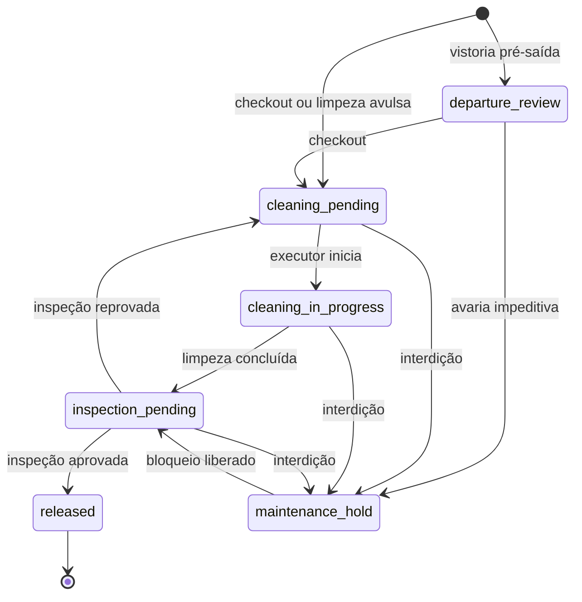

# Governança e prontidão dos quartos

O módulo **Governança** conecta recepção, limpeza e manutenção por meio de um
ciclo de giro do quarto. A situação operacional não depende mais do campo
legado `rooms.status`: a recepção consulta separadamente ocupação, governança e
interdição de manutenção, e a prontidão resulta desses três eixos.

## Ciclo de giro

Um ciclo começa na vistoria pré-saída solicitada para uma estadia hospedada, no
checkout ou em uma limpeza avulsa. O checkout reutiliza o ciclo pré-saída quando
ele existe. Cada tarefa copia a versão ativa do checklist do hotel; alterações
posteriores no modelo não mudam respostas históricas.

O executor assume e inicia a tarefa. Todos os itens obrigatórios precisam de
resposta, e uma reprovação exige observação. Quem concluiu a limpeza não pode
aprovar a inspeção final. Reposição pendente e bloqueio ativo impedem a
liberação. Um ciclo liberado permanece histórico; outra necessidade abre novo
episódio.

A fila ordena os quartos pela próxima chegada confirmada. Chegadas vencidas ou
no dia são críticas; chegadas nas próximas 24 horas aparecem como alerta. Cada
cartão mostra responsável, impedimento, última atualização e próxima ação. A
nota de passagem registra texto e próxima ação no histórico imutável.

## Frigobar e avarias

Durante o check-in, um operador com permissão financeira lança o frigobar pelas
mesmas regras de preço, disponibilidade, estoque e idempotência das comandas. O
vínculo com a vistoria é gravado na mesma transação. Quem não pode lançar consumo
registra o achado para a recepção. Depois do checkout, o achado cria apenas uma
divergência operacional; a conta encerrada não é alterada.

As quantidades encontradas criam uma tarefa de reposição. Sua conclusão registra
a execução, mas não representa estoque ideal por quarto. O movimento físico
continua pertencendo à comanda existente.

Governança pode registrar uma ocorrência restrita ao quarto. Avaria impeditiva
exige previsão de bloqueio e, quando há reservas conflitantes, uma ciência
explícita. Ocorrência, bloqueio e vínculo com o ciclo são atômicos. A liberação
técnica leva o quarto para nova inspeção; somente a governança o libera.

## Check-in e realocação

O check-in bloqueia e revalida estadia, quarto, ciclo e interdições. Um quarto
interditado nunca aceita exceção. Um quarto apenas não liberado pode receber uma
exceção de usuário autorizado, com motivo obrigatório, versão esperada e evento
de auditoria.

Reservas confirmadas ainda sem check-in podem ser realocadas. A simulação lista
quartos do hotel sem sobreposição de estadia ou bloqueio e com capacidade igual
ou superior à acomodação original. A ordem favorece o mesmo tipo, a menor
diferença de tarifa pública e o número do quarto. A confirmação revalida a
disponibilidade, altera somente `stay.room_id`, preserva a diária contratada e
registra origem, destino, motivo, interdição e tarifas comparativas.

## Pendências e permissões

A central recebe episódios de limpeza, inspeção, retenção por manutenção,
reposição, divergência de frigobar e reserva afetada. Para tarefas de governança,
assumir ou devolver usa a mesma atribuição transacional da fila. Abrir apenas
marca leitura; a resolução decorre da situação da fonte.

As permissões são independentes: `read_governance`, `execute_governance`,
`inspect_governance`, `assign_governance`, `manage_governance_templates`,
`override_room_readiness` e `relocate_reservation`. Informações financeiras,
dados de hóspedes e detalhes de manutenção continuam condicionados às permissões
das fontes correspondentes.

Fontes de verdade: migration
`20260910010000_create_governance_operations.sql`, contratos em
`packages/shared/src/governance.ts` e `packages/shared/src/api-contract.ts`,
rotas e repositório de governança no backend e
`apps/pms/src/app/dashboard/governance`.
