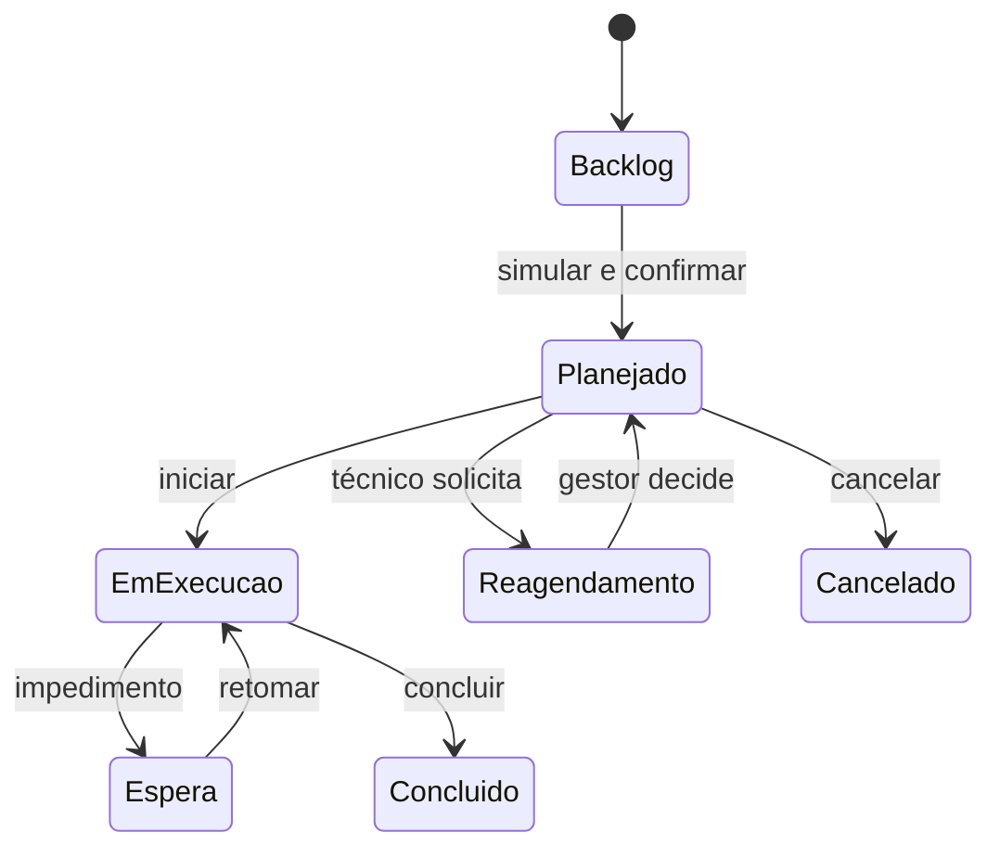
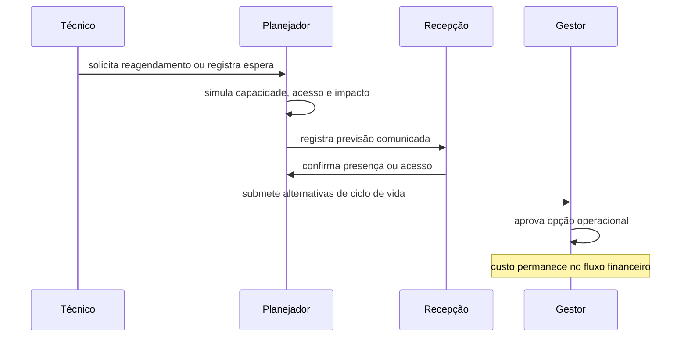

# Gestão avançada de manutenção

Este guia descreve a operação de manutenção preventiva, SLA, fornecedores,
notificações e indicadores. O schema e as funções PostgreSQL continuam sendo a
fonte de verdade das regras transacionais.

## Permissões

- `manage_maintenance_plans`: cria, edita, pausa, retoma e desativa planos;
  também decide competências adiadas.
- `manage_maintenance_sla`: mantém políticas e consulta sua precedência.
- `manage_maintenance_suppliers`: mantém fornecedores, contatos, contratos e
  documentos.
- `read_maintenance_analytics`: consulta indicadores e exportações.
- `read_maintenance_finance`: complementa as permissões acima para revelar
  termos comerciais, custos, recuperações e resultado líquido.

As permissões operacionais existentes continuam controlando execução,
checklists, bloqueios e inspeção. Nenhuma permissão nova é atribuída
automaticamente a roles hospedadas.

O planejamento e a qualidade usam permissões separadas: `manage_maintenance_teams`
mantém equipes e disponibilidade; `manage_maintenance_schedule` confirma a
agenda; `override_maintenance_schedule_conflicts` abre uma exceção justificada;
`propose_maintenance_lifecycle` e `approve_maintenance_lifecycle` separam
proposta e aprovação; `confirm_maintenance_service` registra presença e acesso.
Os papéis sintéticos de gerente recebem essas permissões para os testes locais.

## Preventivas

As ações da ordem acompanham sua situação: iniciar quando atribuída, pausar ou
aguardar durante execução e retomar após uma pausa. A espera pede categoria e
descrição; conclusão pede diagnóstico e serviço realizado. Cancelamentos,
reaberturas e inspeções registram a justificativa informada pelo operador.
Para duplicidades, use a busca por código ou descrição e compare os detalhes
antes de confirmar. O vínculo não transfere ordens, evidências ou cobranças.

Um plano possui um único alvo, responsável interno, categoria, recorrência,
instruções e checklist. A agenda aceita recorrência diária, semanal, mensal e
anual. Dias inexistentes são normalizados para o último dia do mês, inclusive em
anos bissextos.

O ciclo automático cria uma competência única por plano e data local. A geração
bem-sucedida cria atomicamente ocorrência preventiva, ordem, checklist e evento.
Se a execução anterior permanecer aberta, a competência fica `deferred`; um
gestor deve gerar, ignorar ou reagendar com justificativa. Pausar ou desativar o
plano não cancela ocorrências já emitidas.

Itens obrigatórios incompletos impedem a conclusão da ordem. A recomendação de
bloqueio não altera inventário até a confirmação explícita de um usuário com a
permissão operacional correspondente.

## SLA e alertas

A precedência é: categoria e prioridade, prioridade, padrão do hotel. A política
efetiva é copiada para a ocorrência e não muda retroativamente. Resposta termina
na triagem; resolução operacional termina quando todas as ordens não canceladas
foram concluídas e, quando exigido, aprovadas.

Alertas são criados em 75% do prazo, no vencimento e a cada 24 horas de violação.
Contratos e garantias alertam 30, 7 e 0 dias antes do vencimento. A caixa do PMS
permite filtrar, abrir o contexto, marcar como lida ou não lida, dispensar e
marcar todas como lidas.

## Equipes, agenda e acesso

Equipes têm membros com vigência, disponibilidade semanal no fuso do hotel e
exceções de ausência ou capacidade adicional. A simulação considera sobreposição
do técnico, capacidade da equipe, disponibilidade, ocupação, chegada, governança,
bloqueio e a condição exigida para entrar no quarto. O formulário é a interface
completa da agenda em desktop e celular. Um conflito retorna o contexto atual e
só pode ser confirmado por um gestor autorizado, com motivo.

O técnico mantém a responsabilidade individual da ordem e pode solicitar um
novo horário. O pedido entra na central de pendências e não muda a agenda até a
decisão do planejador.



## Esperas e tempos operacionais

Cada espera é um episódio com categoria, descrição, responsável interno e
próxima cobrança. Contatos sucessivos preservam resposta e nova data; retomar
encerra o episódio. Início e retomada abrem sessões de execução, enquanto pausa,
espera, conclusão e cancelamento as encerram. Os intervalos de impacto pertencem
aos quartos confirmados pelo planejador. O consolidado une sobreposições do mesmo
quarto para não contar a mesma quarto-hora duas vezes. O SLA continua em horas
corridas e não é suspenso por esses estados.

Previsões comunicadas registram público, canal, horário e observação sem enviar
mensagem externa. Recepção ou solicitante registra presença, acesso, ausência do
prestador ou acesso negado; essa confirmação não conclui nem inspeciona a ordem.

## Impacto, reincidência e ciclo de vida

O score operacional soma a prioridade técnica, hóspede presente, próxima
chegada, quantidade de quartos, bloqueio, duração do impacto e reincidência,
limitado a 100. Ele ordena a fila e explica cada componente, mas não altera a
prioridade técnica. A reconciliação ocorre após eventos relevantes e no ciclo
de 15 minutos; uma falha de fonte preserva a projeção válida anterior.

A política inicial considera reincidência a terceira ocorrência não cancelada
da mesma categoria e alvo canônico em 90 dias. Duplicidades não contam. Grupos
preservam a primeira ocorrência e podem ser revisados com justificativa.

Avaliações comparam reparo, substituição e garantia por custo estimado,
indisponibilidade, riscos, benefícios, vínculos e evidências. Uma alternativa
única exige motivo. O autor submete, outra pessoa aprova uma opção e a aprovação
financeira continua no fluxo financeiro existente. Executar a decisão registra
o resultado; não cria compra, contato externo nem movimento de estoque.



## Automação local e produção

`pg_cron` agenda `process_maintenance_management_cycle()` a cada 15 minutos. A
função usa locks e chaves únicas, processa cada hotel segundo seu fuso e grava
uma linha em `maintenance_automation_runs`. O endpoint de reprocessamento manual
usa a mesma operação idempotente.

Para validar localmente:

```text
pnpm db:reset
pnpm db:types
pnpm test:db
```

Nunca execute `db reset --linked`. Publicação no Supabase hospedado exige
autorização específica.

## Indicadores e exportações

O dashboard aceita período, categoria, prioridade, alvo, plano, fornecedor e
situação. Além dos indicadores anteriores, mostra carga agendada, aderência,
execução, espera, quarto-horas, reincidências, decisões e garantias. CSV contém
o recorte detalhado e PDF contém o resumo executivo e seus filtros. Sem
`read_maintenance_finance`, valores e colunas financeiras não são consultados
nem incluídos na resposta ou nos arquivos.

Os documentos de fornecedores e contratos são privados, limitados a JPEG, PNG,
WebP e PDF de até 10 MB. O navegador recebe somente URLs assinadas; remoções
exigem motivo e preservam os metadados de auditoria.
