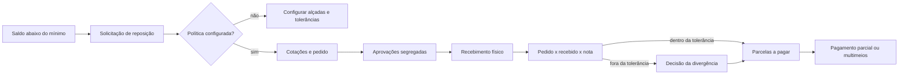
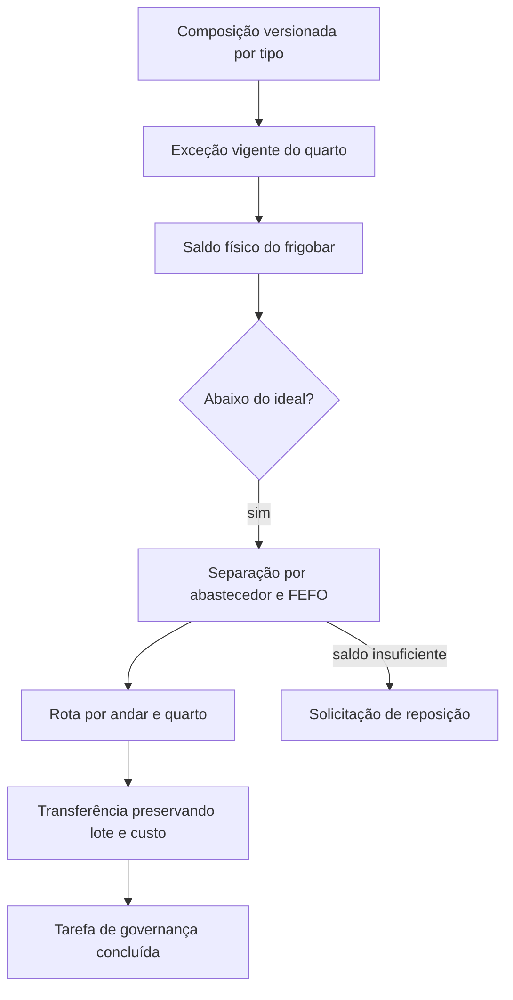
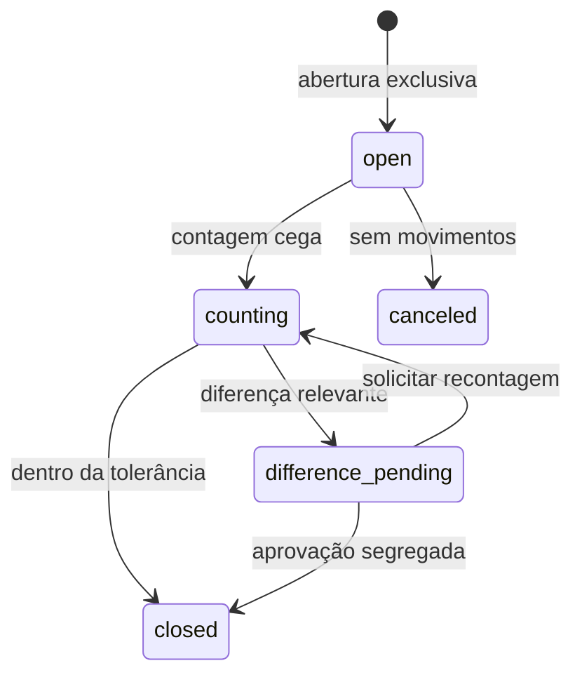

# Estoque, compras, caixa e parceiros

Esta área fecha o caminho entre a necessidade física de um produto e sua
liquidação financeira. Todos os registros pertencem ao hotel ativo. Estoque,
custos, valores e cadastros só aparecem para quem também possui a permissão do
domínio correspondente.

## Organizações e compras

Uma organização centraliza a identidade cadastral de fornecedores, parceiros e
empresas pagadoras, sem misturar contratos, crédito ou permissões desses papéis.
Cadastros com o mesmo documento fiscal normalizado são associados dentro do
mesmo hotel. Divergências permanecem no histórico e exigem revisão. União e
separação manual são auditadas e não apagam referências anteriores.

A reconciliação mantém um rascunho ativo por produto, local e episódio enquanto
o saldo estiver abaixo do mínimo. Solicitações só podem ser consolidadas quando
fornecedor, moeda e destino forem compatíveis. O solicitante não aprova a própria
compra; a faixa superior exige dois aprovadores distintos. Hotéis migrados
começam com a política pendente de configuração.

O recebimento registra quantidades aceitas, recusadas e pendentes. Somente a
parte aceita movimenta estoque. Lote, validade, custo e evidência acompanham a
linha. A nota compara preço e quantidade com a política vigente; uma exceção
fora da tolerância exige outra pessoa. Parcelas aceitam baixas parciais e vários
meios. Dinheiro exige sessão de caixa aberta.

## Lotes, validade e frigobar

Produtos podem operar sem lote, com lote ou com lote e validade. Ao ativar a
rastreabilidade, o operador distribui todo o saldo existente por posição. A soma
dos lotes continua igual ao saldo agregado e o custo contábil permanece na média
móvel. Saídas automáticas usam FEFO: menor validade e, depois, recebimento mais
antigo. Lotes vencidos não saem para consumo ou frigobar; descarte cria perda
imutável.

Cada quarto possui uma localização interna que não aparece como almoxarifado.
Seu saldo inicial vem de contagem, nunca de inferência. O consumo do frigobar
baixa essa localização uma única vez e preserva comanda, benefício, parceiro e
apuração. Quartos sem composição ativa continuam no fluxo manual.

## Caixa e fechamento diário

Cada caixa físico aceita uma sessão ativa e um operador. Todos os recebimentos
do ponto entram na conciliação; apenas dinheiro altera o valor físico esperado.
Suprimento, retirada, depósito, reembolso e ajuste são movimentos imutáveis. A
troca de operador encerra a sessão anterior por contagem e transporta o saldo
para a seguinte.

Na contagem cega, o operador informa o valor sem conhecer o esperado. O resultado
só é apresentado depois. Diferença acima da tolerância exige justificativa e
decisão de outra pessoa. Uma aprovação aceita a diferença; qualquer ajuste
financeiro continua sendo uma operação separada e justificada.

O fechamento diário usa a data civil no fuso do hotel. A preparação registra um
snapshot e uma impressão digital de caixas e transações. Mudanças posteriores
exigem nova preparação. Outra pessoa aprova. Sessões abertas, dinheiro sem sessão
e eventos financeiros incompletos bloqueiam o fechamento. Um lançamento tardio
fica na data atual e referencia a data e o fechamento originais.

## Parceiros e pendências

Apurações passam a mostrar aprovação, liquidação e contestação separadamente.
Uma contestação atinge um componente e retém somente aquele valor; o saldo livre
pode ser pago ou recebido parcialmente e com vários meios. Se a contestação for
aceita, seu valor permanece excluído do saldo liquidável. Ajustes posteriores
referenciam a apuração original na competência aberta.

A central de pendências recebe episódios de ruptura, validade, compra, nota,
conta vencida, caixa, fechamento, contestação e divergência cadastral. O
responsável e a resolução vêm da entidade de origem. A reconciliação percorre o
hotel inteiro e preserva episódios anteriores quando uma fonte falha.

Fontes de verdade: migrations `20260913010000` a `20260913040000`, contratos em
`packages/shared/src/operations-finance.ts` e `packages/shared/src/api-contract.ts`,
rotas em `apps/backend-service/src/routes/operationsFinanceRoutes.ts` e páginas
`/dashboard/procurement`, `/dashboard/inventory`, `/dashboard/cash` e
`/dashboard/organizations`.
