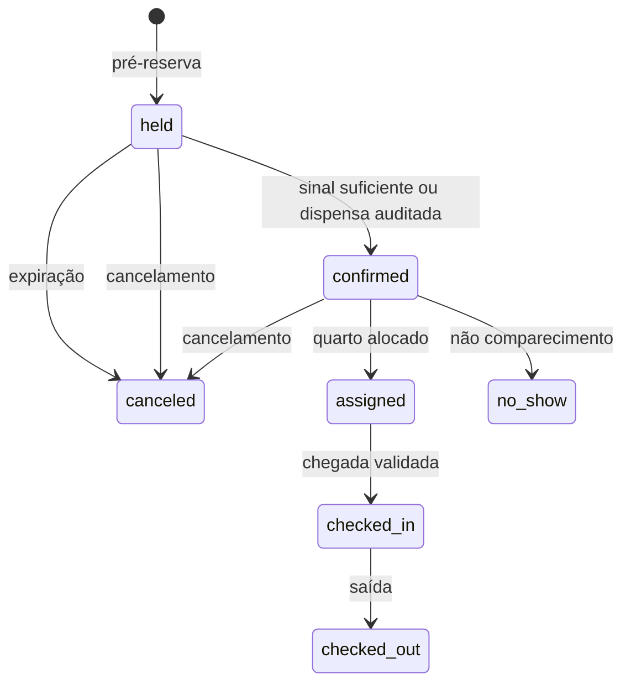
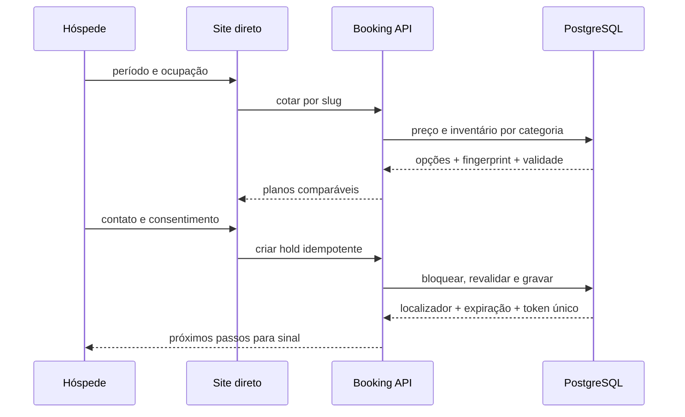

# Reservas, pré-chegada e venda direta

Este guia descreve o domínio consolidado de reservas. O calendário interno, o
site direto e o hub de canais usam o mesmo inventário por categoria, snapshots
de diária e regras transacionais. Consulte também a [arquitetura](architecture.md),
o [workflow do banco](database-workflow.md) e os contratos
[administrativo](openapi.json) e [público](booking-openapi.json).

## Inventário e tarifas

Uma reserva contém uma ou mais acomodações contratadas por categoria. O quarto
físico pode ser alocado depois. A disponibilidade é calculada por noite e
desconta acomodações confirmadas, estadias em andamento, pré-reservas vigentes e
bloqueios de manutenção. Holds vencidos deixam de consumir inventário no próprio
cálculo, mesmo antes da reconciliação periódica.

Cada diária guarda a versão do plano, tarifa-base, temporada, ajuste do plano,
suplemento de ocupação, benefício e total. Versões ativadas são imutáveis. Uma
alteração preserva noites que não mudaram e cria lançamentos compensatórios para
a diferença; estadias iniciadas só podem alterar o trecho futuro. Troca de
quarto na mesma categoria preserva o preço.

A garantia e a política de cancelamento são copiadas da versão tarifária. O
sinal é registrado na conta da reserva e pode usar vários meios; dinheiro exige
sessão de caixa. A confirmação, a garantia e a reserva mudam na mesma transação.
No check-in, créditos são transferidos por lançamentos compensatórios para as
subcontas da estadia.

## Pré-chegada e relacionamento

Links de pré-chegada usam tokens opacos e temporários. Somente o hash é
persistido; regenerar o acesso revoga o anterior. Respostas públicas para token
inválido, expirado ou revogado não revelam se a reserva existe.

O hóspede pode completar dados, informar acompanhantes, registrar horário,
preferências e pedidos especiais. Solicitações de alteração ou cancelamento não
mudam o contrato: a equipe precisa simular disponibilidade e efeito financeiro
e confirmar a decisão no PMS. Pedidos especiais passam por triagem e só reservam
estoque, capacidade ou valores quando convertidos explicitamente.

Preferências são declarações com categoria, valor, origem, consentimento,
vigência e revogação. Observações livres e inferências históricas nunca viram
preferências automaticamente. Documento normalizado é único somente dentro do
hotel.

## Site direto e canais

`apps/public` atende a jornada multi-hotel na porta 3000. O slug identifica o
hotel e somente configurações publicadas aparecem. A interface expõe categoria,
capacidade, comodidades publicáveis, planos, políticas, benefícios e preço; não
expõe número de quarto, ocupantes anteriores, prontidão interna ou motivo de
bloqueio.

`apps/booking-engine-service` atende a API pública na porta 3333. Cotações têm
prazo e fingerprint. A criação de pré-reserva revalida cotação, versão tarifária
e inventário, usa idempotência e devolve localizador, vencimento e acesso de
pré-chegada. O limite de requisições persiste apenas um identificador derivado;
logs não devem incluir contatos, documentos ou tokens.

Conexões de canal são neutras. O provedor assina o timestamp, um ponto e o JSON
canônico por HMAC SHA-256, usando o digest SHA-256 da credencial rotacionável
como chave. Eventos são idempotentes
por conexão e identificador externo. Falta de mapeamento ou inventário coloca o
evento em revisão; o sistema nunca cria overbooking silencioso. O feed de
inventário e tarifas é consultivo e registra confirmações de leitura.

## Indicadores e pendências

Os fatos diários usam a data operacional no fuso do hotel. `forecast` separa
ocupação confirmada, holds, indisponibilidade, chegadas, saídas, acomodações sem
quarto e receita prevista. `actual` reúne ocupação, receita, consumo, perdas,
manutenção, cancelamentos e no-show. Datas fechadas preservam o snapshot
realizado; lançamentos tardios pertencem à data operacional atual.

Drill-down, totais e valores obedecem às permissões da origem. Uma falha de
reconciliação preserva o último snapshot e marca a série como desatualizada.
Pendências de chegada sem quarto, pré-chegada, solicitações e canais são
resolvidas pela entidade de origem, mantendo leitura pessoal e responsável
compartilhado.

## Operação e segurança

- O hotel ativo limita toda rota administrativa e referência composta.
- O site valida hotel ativo e publicado; CORS aceita apenas origens configuradas.
- Tokens e credenciais aparecem em claro uma única vez e não entram em logs.
- Preço, disponibilidade, versão e idempotência são revalidados em mutações.
- Conflitos concorrentes retornam `409` com contexto para nova revisão.
- Tours usam `data-usage-guide`; formulários preservam teclado, foco, anúncios e
  uso móvel.

Os testes de referência estão em `packages/shared/__tests__/unit/booking.test.ts`,
`apps/booking-engine-service/__tests__`,
`apps/backend-service/__tests__/unit/bookingOperationsRoutes.test.ts` e
`supabase/tests/database/booking_stage6.test.sql`.
